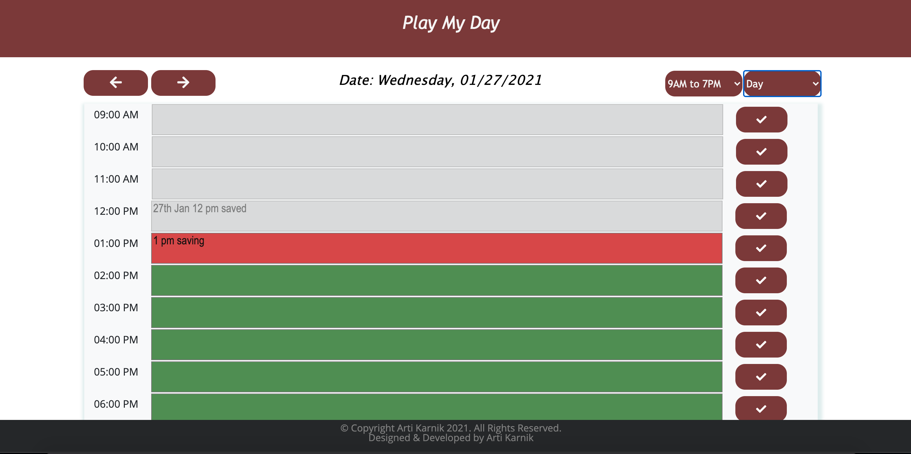
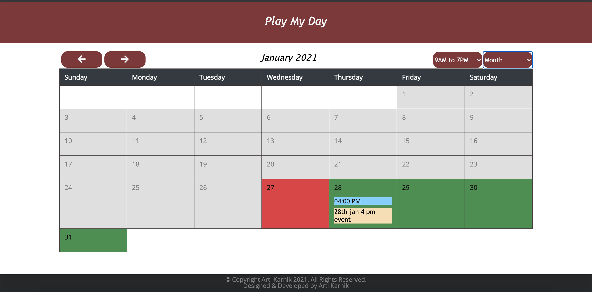

# DayPlaneer:

<strong> Project Summary: </strong>  
A simple day planner application that will allow the user to add events in one hour time slots.

      
       
       s
   
      
   
      

 

<strong> Purpose: </strong>  
Apply learnings from Jquery with HTML, CSS & Bootstrap to build a single-page Day Planner application   

<strong> Description: </strong>  
Developed a day planner application that will allow the user to add events in one hour time slots. User have option to select date and time with  Day, Week or Month view. By default, current day & view of 9am to 7pm will load. For past time , it will appear in gray, present time in red and future time with green color. 
Users can add, edit or remove the event details per hour. All of this information will be stored locally.

<strong>  Additional Implementation Details: </strong> 
1. Dropdown menu with Day/Week/Month views has been added. 'Day' is the default selected option.
<ul> 
      <li>
             Day: User can add events in single day view, 24 hours slots are available (view can change to 9 AM- 7 PM. Slot color will be based on current time. By default, current date is shown.
      </li>
       <li>
              Week:  Based on the currently chosen day/date, it's respective week view will be shown in a grid format. Here, week is
considered from Sunday to Saturday of the 7 day period. Columns are the days of the week & rows indicate hourly time slots based on the selection of  other dropdown options (Standard Hours or 24 Hours). Each slot will follow the same color pattern to indicate if it is past, present or future. User can select it date-time slot and enter details. Details saved will be viewed in all other views too.
      </li>
      <li>  Month:  
 Similar to the week view, 'Month' view has also been implemented. Current month calendar is shown and follow same color code pattern. User can select it date slot and enter details. Details saved will be viewed in all other views too.</li>
     
       
      
</ul>
   
  2.  Next and Previous navigation:   Left & right directed arrows, allow the user to navigate past & future days. as per selection, Next-Previous works for Day , Week and Month view.

3. Hours:    Users can add/view either for entire day(24 hours) OR standard business hours (9 AM -7 PM). This is controlled by selecting dropdown option from top-right side.

4. All details are saved locally.

<strong>Testing: </strong>  
Unit tested the page on Windows (Chrome, Edge), Mac, Mobile to ensure that the layout is consistent in full view as well as in the responsive mode.

<strong> Code Installation: </strong>  
$ cd [path_to_save_codebase]  

$ git clone https://github.com/arti-karnik/DayPlanner  

<strong> Github Profile: </strong>  
https://github.com/arti-karnik

<strong> Code-base: </strong>  
https://github.com/arti-karnik/DayPlanner

<strong> Application Live URL: </strong>  
https://arti-karnik.github.io/DayPlanner/

