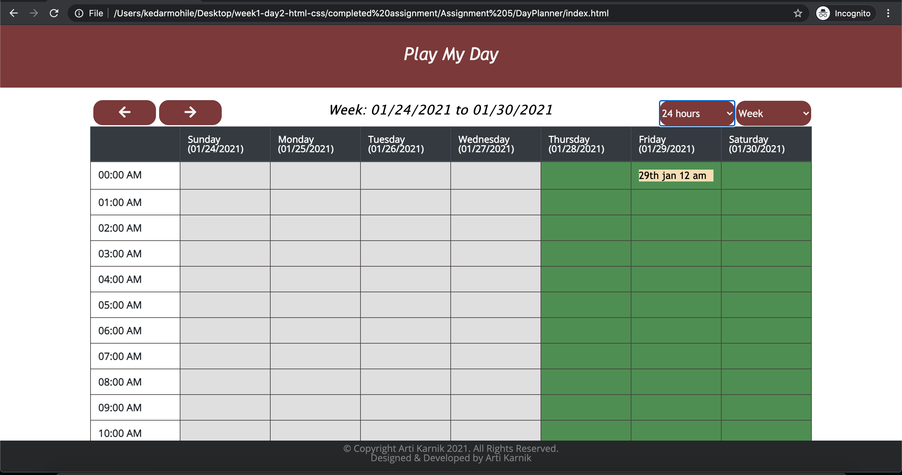

# DayPlaneer:

<strong> Project Summary: </strong>  
A simple day planner application that will allow the user to add events in one hour time slots.

      
       
       s
   
      
   
      

 

<strong> Purpose: </strong>  
Apply learnings from Jquery with HTML, CSS & Bootstrap to build a multi-page Quiz application   

<strong> Description: </strong>  
 I have developed a sample day planner application that will allow the user to add events in one hour time slots.
By default, current day & view of 9am to 7pm will load. Day & Date details are displayed above the grid. If the corresponding hour has passed, the
row segment will appear in grey color, if it's the current hour, it will appear in red & all future hours will be highlighted in green.
Users can add, edit or remove the event details per hour. All of this information will be stored locally.

Additional Implementation Details:
1. Left & right directed arrows, displayed top left above the grid, allow the user to navigate past & future days, one at a time.

2. Users can view details of the entire day (all 24 hours) by selecting '24 Hours' under the 'Standard hours' dropdown menu. In this view, hourly time
slots from 0:00 am to 12:00 am will be shown & color code based on current time.

3. Another dropdown menu with Day/Week/Month views has also been added. 'Day' is the default selected option.

4. On selecting the week view, based on the currently chosen day/date, it's respective week view will be shown in a grid format. Here, week is
considered from Sunday to Saturday of the 7 day period. Columns are the days of the week & rows indicate hourly time slots based on the selection of
other dropdown options (Standard Hours or 24 Hours). Example: in the day view, if the user is on Saturday 01/30/2021 & then switches to 'Week' view, the
week from 01/24/2021 (Sunday) to 01/30/2021 (Saturday) will be shown. In this view, each hour of each day will follow the same color pattern to
indicate if it is past, present or future. Events saved in the day view will display in the corresponding cell (day + hour combination) in the weekly
view. Users can choose to add an event in the weekly view as well. Upon clicking the required day & time cell, a small modal will open. It will display
the date & time in a dropdown format - starting hour of the chosen slot will be preselected. Users can enter the event description & save it locally.
Upon saving (and page refresh) the event will be displayed in the corresponding tabular cell. These event details can be edited or deleted as well.
While in the weekly view, users can directly navigate 'Previous' & 'Next' weeks using the 'Left' & 'Right' directed arrows in the top left corner.

5. Similar to the week view, 'Month' view has also been implemented. Here the 'Left' & 'Right' directed arrows will navigate previous & next month(s).
The current day will be highlighted completely in red, while all past days will be displayed in grey & all future days in green color.
For event details, the first one added by the user (in any time slot) is presently being displayed. Example: in the day view, user first adds an event
for 1/30/2021 2-3pm & then for 10-11am. In the month view, for January30, the 2-3pm event title will show.
Clicking on the date will open a modal with date , time & description of the event pre-populated. Users can edit time & description of the event & the
same will reflect in day & week views.
New events can also be added from the month view. Presently, all 24 hourly time slots are shown irrespective of the Standard Hours or 24 hours selection.

<strong>Testing: </strong>  
Unit tested the page on Windows (Chrome, IE11 & Edge), Mac, Mobile to ensure that the layout is consistent in full view as well as in the responsive mode.

<strong> Code Installation: </strong>  
$ cd [path_to_save_codebase]  

$ git clone https://github.com/arti-karnik/DayPlanner  

<strong> Github Profile: </strong>  
https://github.com/arti-karnik

<strong> Code-base: </strong>  
https://github.com/arti-karnik/DayPlanner

<strong> Application Live URL: </strong>  
https://arti-karnik.github.io/DayPlanner/

